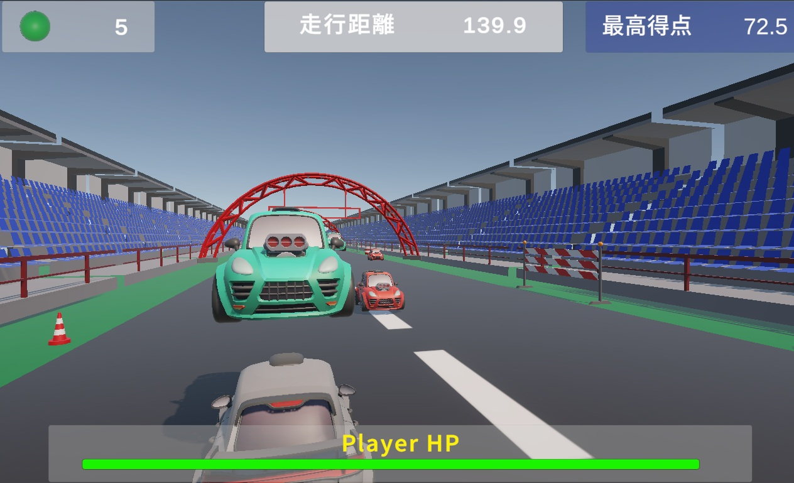

# BattleCart
## BattleCartについて
プレイヤーとなるカードを操作して走行距離を伸ばしていくゲームです。
ステージの奥から敵が迫ってくるので、ぶつからないように避けながら進みます。
  
どんどんスピードが速くなるので後半にいけばいくほど一気に記録が伸びる爽快感と
一瞬でクラッシュしてしまうスリルが癖になるように作りました。

## ゲームプレイ方法
[ゲームのサンプルプレイ](https://ｘｘｘｘ.github.io/BattleCart_web/)

### 操作方法
Aキー（左キー）：レーンを左に移動
Dキー（右キー）：レーンを右に移動
スペースキー：ジャンプ
マウス操作：視点を回転
マウス左クリック：シュート

### ゲームルール
* 敵とぶつかってPlayerのHPがゼロになったらゲームオーバー
* 敵はシュートされた弾で破壊できる
* 弾の残数は限りがある（自動回復）
* 走行距離が記録されるので、最高記録の塗り替えを目指す
* タイトルで記録をリセット可能

## 仕様技術
* ゲームエンジン：Unity
* 仕様言語：C#
* 仕様Tool：VisualStudio, SourceTree

## 開発の工夫
